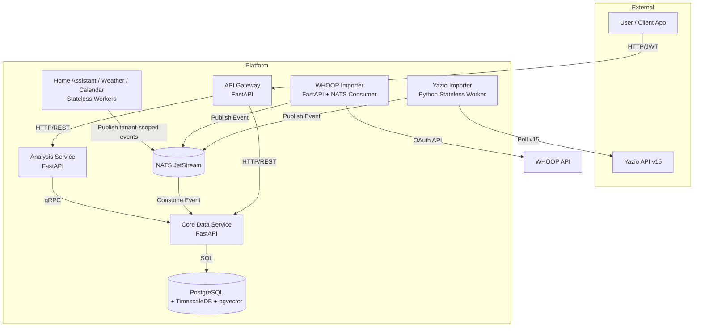

# 🔬 Quantified Self Platform

A SaaS-ready, microservice-based personal data analytics platform.

[](https://github.com/iamTim0/quantified-self/actions/workflows/ci.yml)


## Documentation

Built from `docs/` with Material for MkDocs and served as its own container. A
deployment publishes it at `/docs` on the same host as the dashboard; the
hostname comes from `PUBLIC_HOST` and is not baked into the repository.

Locally: `task docs:serve` → <http://127.0.0.1:8003>

Start here:

| Page | What it covers |
| --- | --- |
| [Architektur](docs/architecture.md) | Services, data flow, idempotency, tenant isolation |
| [Betrieb](docs/operations.md) | Deployment, required secrets, monitoring, backup |
| [Smart-/Force-Import](docs/features/smart-import.md) | Adaptive windows and duplicate detection |
| [Authentifizierung](docs/features/authentication.md) | Sessions, logout, tenant mapping |
| [API-Keys](docs/features/api-keys.md) | Tenant-bound inbound keys |
| [Fehlerbehebung](docs/troubleshooting.md) | Common failures and what they mean |

## Deploying it

From published images, not from source: `.github/workflows/release.yml` builds all
thirteen images, pushes them to `ghcr.io/iamtim0/quantified-self/*` and attaches a
deployment bundle to a GitHub Release. The host needs Docker and nothing else — no
checkout, no toolchain. See [Release & Deployment](docs/deployment.md) for the full
procedure, and for the `ENCRYPTION_KEY` ordering trap.

```bash
curl -fsSL https://github.com/iamTim0/quantified-self/releases/download/v1.0.0/quantified-self-1.0.0-deploy.tar.gz | tar -xz
cd quantified-self-1.0.0

# Fill in PUBLIC_HOST and the three secrets — compose refuses to start without
# them — and POSTGRES_PASSWORD, which is only choosable before the first start.
$EDITOR .env

docker compose -f docker-compose.prod.yml config >/dev/null   # names any missing variable
docker compose -f docker-compose.prod.yml pull
docker compose -f docker-compose.prod.yml up -d
docker compose -f docker-compose.prod.yml run --rm core alembic upgrade head
docker compose -f docker-compose.prod.yml run --rm core \
  python -m core.create_owner --email you@example.com --workspace "My Data"
```

From a checkout, `task prod:config`, `task prod:up` and `task prod:owner` do the
same. Upgrading is `QS_VERSION` in `.env`, then `pull`, `up -d` and the migration.

Then check it from the outside — reachable, closed, and what it reports about its
own configuration:

```bash
OWNER_EMAIL=you@example.com OWNER_PASSWORD='…' \
  bash tools/smoke_deployment.sh https://$PUBLIC_HOST
```

> **Before deploying:** `JWT_SECRET`, `INTERNAL_SERVICE_SECRET` and `ENCRYPTION_KEY`
> ship with development defaults that are committed to this repository. The
> production stack now refuses to start without real values, and `ENCRYPTION_KEY`
> needs stored credentials re-encrypted *before* it changes. See
> [Betrieb](docs/operations.md).

## Architecture Overview

The Quantified Self Platform uses a microservice architecture built for scale, isolation, and robustness. It separates data ingestion, storage, and analysis into distinct services that communicate asynchronously or via strict RPC contracts.



### Services

| Service | Port | Purpose | Communication |
| --- | --- | --- | --- |
| **API Gateway** | 8000 | Auth, routing, JWT validation, injects tenant context | HTTP (REST) in/out |
| **Core** | 8001 | Owns DB. Consumes ingestion events. Serves gRPC queries | NATS (in), gRPC (out), PostgreSQL |
| **Analysis** | 8002 | AI/Data Science, complex queries, embeddings | gRPC (to Core), HTTP (from Gateway) |
| **Yazio Importer** | Container | Polls Yazio API v15 for meals, products & daily macros | NATS publisher (`qs.ingest.yazio`) |
| **WHOOP Importer** | 8013 (internal) | Request-driven cycles, recovery, sleep and workout import | NATS task consumer/publisher (`qs.ingest.whoop`) |
| **Home Assistant Importer** | Container | Polls authorized environmental sensor states | NATS (`qs.ingest.home_assistant`) |
| **Weather Importer** | Container | Polls Open-Meteo-compatible weather timelines | NATS (`qs.ingest.weather`) |
| **Calendar Importer** | Container | Polls ICS/iCalendar event summaries | NATS (`qs.ingest.calendar`) |
| **Docs** | 8003 (`/docs`) | Material for MkDocs static documentation | Traefik route (`/docs`) |

## Tech Stack

| Category | Technology | Purpose |
| --- | --- | --- |
| **Backend Framework** | Python 3.12+, FastAPI | High-performance async APIs |
| **Database** | PostgreSQL 16, TimescaleDB, pgvector | Time-series data, vector embeddings, relational data |
| **ORM & DB Drivers** | SQLAlchemy 2.0, asyncpg | Async database access |
| **Message Broker** | NATS JetStream | Asynchronous, durable data ingestion |
| **RPC & Serialization**| gRPC, Protobuf (`buf`) | Fast, typed internal communication |
| **Dependency Mgmt** | `uv` | Fast Python package management |
| **Orchestration** | Docker Compose | Local development, testing and production |
| **CI / Release** | GitHub Actions, GHCR | Gates on every push; images and releases published manually |
| **Task Runner** | Taskfile | Cross-language script execution |
| **Documentation** | MkDocs + Material for MkDocs | Markdown code-to-documentation site under `/docs` |
| **Formal Verification**| Fizzbee | Designing and verifying distributed systems |

## Project Structure

```text
quantified-self/
├── apps/
│   └── dashboard/
│       ├── src/proxy.ts   # Server-side route guard (Next 16's middleware.ts)
│       ├── src/app/       # Next.js 16 Web Dashboard UI
│       └── e2e/           # Playwright browser tests
├── services/
│   ├── api-gateway/       # Auth, routing, JWT, streaming UI proxy
│   ├── core/              # Owns PostgreSQL, NATS consumer, gRPC server, scheduler
│   ├── analysis/          # AI/DS, queries Core via gRPC — no database driver
│   └── importers/
│       └── yazio/         # NATS publisher, polls Yazio API v15
├── packages/
│   ├── proto/             # Protobuf definitions (buf)
│   └── shared-schemas/    # Shared Pydantic models
├── specs/                 # Fizzbee formal specifications (13, all model-checked)
├── infra/                 # Infrastructure configuration
│   ├── docker-compose.yml
│   ├── fizzbee.Dockerfile # The model checker; no Windows build exists
│   └── db/init.sql        # Schema for a fresh container. No seed data.
├── .agents/scripts/       # Lifecycle hooks and spec tooling, shared by all agents
├── tools/build_images.py  # The published image list; the release workflow reads it
├── docker-compose.prod.yml # Production stack from published images. No build:
├── Taskfile.yml
├── README.md
└── AGENTS.md
```

## Getting Started

### Prerequisites
- Docker & Docker Compose
- `uv` (Python dependency manager)
- Taskfile (`go-task`)
- Node.js 22 & pnpm 9+

### Clone & Setup
```bash
git clone https://github.com/iamTim0/quantified-self.git
cd quantified-self
task setup
```

### Start Infrastructure & Microservices
Start all backing services and microservices using Docker Compose:
```bash
docker compose -f infra/docker-compose.yml up -d
```

### Run Services Locally
You can run individual services or all importers locally using Taskfile commands:
```bash
task run:core
task run:gateway
task run:importers:all           # Concurrently run all importer microservices
task run:importer:yazio          # Or run individual importers (apple-health, calendar, dawarich, etc.)
task dashboard
task docs:serve                  # Documentation at http://localhost:8003
```

### Environment Variables

| Variable | Description | Production |
| --- | --- | --- |
| `DATABASE_URL` | PostgreSQL connection string | required |
| `NATS_URL` | NATS JetStream URL | required |
| `ENVIRONMENT` | `production` makes the secret checks below fatal instead of a warning | recommended |
| `PUBLIC_HOST` | Hostname Traefik serves on. Deliberately absent from this repository | required |
| `ALLOW_REGISTRATION` | Self-registration. **Defaults to `false`** — create the first account with `python -m core.create_owner` | optional |
| `JWT_SECRET` | Signs user access tokens | **required — the default is published here** |
| `INTERNAL_SERVICE_SECRET` | Signs internal service credentials; identical on Core and every importer | **required** |
| `ENCRYPTION_KEY` | Fernet key for connector credentials at rest | **required — read the note below first** |

The development defaults for those three are in this repository, so a deployment
that uses them has no secrets. Core and the Gateway refuse to start on a published
default when `ENVIRONMENT` is production-like, and `docker-compose.prod.yml`
uses `${VAR:?…}` so a missing value stops the deploy before a container starts.

> **`ENCRYPTION_KEY` is not a restart.** It decrypts stored connector
> credentials; changing it without re-encrypting first makes every stored token
> permanently unreadable. Run
> `python -m core.rotate_encryption_key --old … --new … --dry-run` first, then
> without `--dry-run`, and only then change the variable. See
> [docs/operations.md](docs/operations.md).

## Database Schema

The database utilizes PostgreSQL extended with **TimescaleDB** for hypertable-based time-series data storage and **pgvector** for AI embeddings. Additional flexibility is provided via JSONB metadata columns.

### Key Tables
- `tenants`: Core multi-tenancy workspace entity.
- `users`: Individual user accounts with roles and hashed credentials. `sessions_valid_from` is the cutoff that makes "revoke every session" cover access tokens already in circulation, not just refresh tokens.
- `data_sources`: Registered integrations (e.g., user's Yazio connector).
- `data_points`: TimescaleDB hypertable containing actual metrics.
- `tenant_shares`: Explicit consent grants for cross-tenant data sharing.

`infra/db/init.sql` creates the schema for a fresh container and seeds **nothing**.
It used to end by inserting an owner account with a bcrypt hash committed to this
repository. Create the first account through sign-up.

### Deduplication Strategy
Deduplication happens at the database level using a 64-character SHA256 `idempotency_key`:
$$\text{SHA256}(\text{tenant\_id} + ":" + \text{source\_id} + ":" + \text{metric\_type} + ":" + \text{timestamp})$$
The core service executes `INSERT INTO data_points ... ON CONFLICT (tenant_id, idempotency_key, timestamp) DO NOTHING`.

## Documentation Site

Importer and feature documentation is maintained as Markdown under `docs/` and built with MkDocs + Material for MkDocs. In Docker Compose, Traefik routes the docs service under `/docs`, separate from the product dashboard. Use `task docs:serve` for local authoring and `task docs:build` for strict static-site validation.

## Data Quality and Analysis

The tenant-scoped Data Quality Center exposes daily gap detection, cross-source conflict detection and deterministic Pearson correlations. The Dashboard explains what each quality signal means, shows recommendations for missing data or source conflicts, and places correlations in the `/analysis` area with simple strength labels. The visual import API accepts at most 5,000 mapped rows per request, verifies ownership of every source and applies the same exact-once constraint as broker ingestion. The Dashboard route `/quality` presents the quality indicators without exposing data from other workspaces.

## Multi-Tenancy & Data Sharing

### Tenant Isolation
The platform employs **application-level filtering**. Every database query in the Core service MUST explicitly filter by `tenant_id`. The API Gateway extracts the `tenant_id` from the JWT and passes it downstream (`X-Tenant-ID`).

### Data Sharing
Cross-tenant sharing uses an explicit consent model via the `tenant_shares` table.

## Adding a New Importer

API importers are stateless workers fetching data and pushing it into NATS JetStream.

1. **Create Directory**: Make `services/importers/<name>/`
2. **Template**: Copy structure from `services/importers/yazio/`.
3. **Client**: Implement `client.py` to handle external API pagination, rate limits, and auth.
4. **Transformer**: Implement `transformer.py` to map external JSON to standard platform `DataPoint` records.
5. **NATS Subject**: Configure publishing to `qs.ingest.<name>`.
6. **Docker**: Add the service to `infra/docker-compose.yml` (dev, builds from
   source), to `docker-compose.prod.yml` (production, pulls the published image)
   and to the image manifest in `tools/build_images.py` — CI fails if a Dockerfile
   is in neither list there, because an unpublished image cannot be deployed.
7. **Tests**: Add unit and integration tests.

## Fizzbee (Formal Verification)

We use **Fizzbee** to mathematically model and verify our distributed architecture
patterns before writing code. The 13 specifications live in `specs/` and every one
of them is model-checked.

```bash
task fizz:lint                       # structural check, runs anywhere including Windows
task fizz:check                      # the real model check (needs the container or a `fizz` on PATH)
task fizz:one SPEC=tenant_isolation  # one specification
```

`fizz:lint` runs on every push; the model check runs when a specification changes
and weekly, because it needs a 340 MB toolchain that has no Windows build. Both
are wired into CI (`.github/workflows/ci.yml` and `specs.yml`).

Tests reference the invariant they exercise in their docstring, and the reverse
holds too: an invariant is written so that removing a clause from the
implementation produces a counterexample naming that clause.
