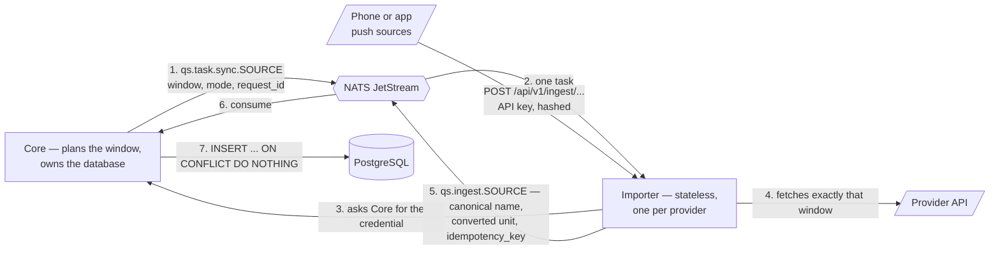

# 🔬 Quantified Self Platform

A SaaS-ready, microservice-based personal data analytics platform.

[](https://github.com/iamTim0/quantified-self/actions/workflows/ci.yml)


## Documentation

Built from `docs/` with Material for MkDocs and served as its own container. A
deployment publishes it at `/docs` on the same host as the dashboard; the
hostname comes from `PUBLIC_HOST` and is not baked into the repository.

Locally: `task docs:serve` → <http://127.0.0.1:8003>

Start here:

| Page | What it covers |
| --- | --- |
| [Architecture](docs/architecture.md) | Services, data flow, idempotency, tenant isolation |
| [Operations](docs/operations.md) | Deployment, required secrets, monitoring, backup |
| [Smart and force import](docs/features/smart-import.md) | Adaptive windows and duplicate detection |
| [Authentication](docs/features/authentication.md) | Sessions, logout, tenant mapping |
| [API keys](docs/features/api-keys.md) | Tenant-bound inbound keys |
| [Troubleshooting](docs/troubleshooting.md) | Common failures and what they mean |

## Deploying it

From published images, not from source: `.github/workflows/release.yml` builds all
thirteen images, pushes them to `ghcr.io/iamtim0/quantified-self/*` and attaches a
deployment bundle to a GitHub Release. The host needs Docker and nothing else — no
checkout, no toolchain. See [Release & Deployment](docs/deployment.md) for the full
procedure, and for the `ENCRYPTION_KEY` ordering trap.

For Coolify, choose the Docker Compose build pack at repository root and set the
Compose file to `docker-compose.coolify.yml`; it uses Coolify's managed network
and proxy instead of the standalone Traefik stack.

```bash
curl -fsSL https://github.com/iamTim0/quantified-self/releases/download/v1.0.0/quantified-self-1.0.0-deploy.tar.gz | tar -xz
cd quantified-self-1.0.0

# Fill in PUBLIC_HOST and the three secrets — compose refuses to start without
# them — and POSTGRES_PASSWORD, which is only choosable before the first start.
$EDITOR .env

docker compose -f docker-compose.prod.yml config >/dev/null   # names any missing variable
docker compose -f docker-compose.prod.yml pull
docker compose -f docker-compose.prod.yml up -d   # migrates, then serves
docker compose -f docker-compose.prod.yml run --rm core \
  python -m core.create_owner --email you@example.com --workspace "My Data"
```

From a checkout, `task prod:config`, `task prod:up` and `task prod:owner` do the
same. Upgrading is `QS_VERSION` in `.env`, then `pull` and `up -d`: the
`core-migrate` service applies pending migrations before Core starts.

Then check it from the outside — reachable, closed, and what it reports about its
own configuration:

```bash
OWNER_EMAIL=you@example.com OWNER_PASSWORD='…' \
  bash tools/smoke_deployment.sh https://$PUBLIC_HOST
```

> **Before deploying:** `JWT_SECRET`, `INTERNAL_SERVICE_SECRET` and `ENCRYPTION_KEY`
> ship with development defaults that are committed to this repository. The
> production stack now refuses to start without real values, and `ENCRYPTION_KEY`
> needs stored credentials re-encrypted *before* it changes. See
> [Operations](docs/operations.md).

## How it works

Ingestion is **pull from the platform, never push from a worker**: Core decides when a
connector is due and what period to ask for, and an importer only ever executes the task
it is handed. That is what keeps the importers stateless — they hold no schedule, no
cursor and no credentials of their own.



Reading the numbered path once:

1. **Core plans.** It knows the poll interval *and* the import history, so it computes the
   window — the overlap that catches late-arriving data, extended to an older gap if one is
   known — records a `SyncRun`, and publishes the task. Nothing else could: only Core has
   the database.
2. **The importer fetches its credential** from Core at run time. Tokens live encrypted in
   the database (Fernet AES-256) and never in an importer's `.env`. Without one it stays
   idle instead of inventing data.
3. **It calls the provider** for that window and nothing wider.
4. **It publishes canonical events.** The metric name comes from the shared registry and the
   value is converted into the unit that registry declares, *before* the
   `idempotency_key = SHA256(tenant_id:source_id:metric_type:timestamp)` is derived — the
   name is part of the hash.
5. **Core consumes**, in a queue group, so replicas share the work.
6. **Core writes** with `ON CONFLICT DO NOTHING`. Re-importing a period is therefore free of
   consequence, which is what lets step 1 overlap on purpose.

For push sources — Apple Health and Streak — steps 1 to 3 do not happen: the phone or the
app sends to the importer, which resolves the tenant from a hashed API key and continues at
step 4.

Every hop carries the same `X-Request-ID`, so one import can be followed from the click to
the row. The full picture, including sessions and the scheduler, is in
[Architecture](docs/architecture.md).

### Services

| Service | Address | Responsibility | Database |
| --- | --- | --- | --- |
| **Traefik** | `:8080` | The single origin: `/` to the dashboard, `/api` to the Gateway, `/docs` to the docs, `/ingest` to the Streak importer | no |
| **API Gateway** | `:8000` | Verifies the JWT, injects `X-Tenant-ID` and `X-Request-ID`, proxies | no |
| **Core** | `:8001`, gRPC `:50051` | REST API, ingest consumer, scheduler, import planning, migrations | **yes, exclusively** |
| **Analysis** | `:8010` | Correlations, trends, anomalies, weekday routines | no — reads Core over gRPC |
| **Dashboard** | `:3000` | Next.js interface, bilingual | no |
| **Docs** | `:8003` at `/docs` | This documentation, built with Material for MkDocs | no |
| **Importers** | see below | One per provider, stateless | no |

## Importers

Eight services, all built the same way: `config.py`, `client.py`, `transformer.py`,
`main.py`; credentials from Core at run time; canonical metric names from the shared
registry; publish to `qs.ingest.<source>`. *Active* means the platform fetches from the
provider on Core's schedule; *passive* means the data arrives when the provider or the
device sends it.

| Importer | Kind | What it brings in | Subject |
| --- | --- | --- | --- |
| **WHOOP** | active | Recovery, sleep, strain, workouts. Core renews the OAuth token before it expires | `qs.ingest.whoop` |
| **Yazio** | active | Food diary, calories, macronutrients, per-meal energy | `qs.ingest.yazio` |
| **Apple Health** | passive | Steps, heart rate, HRV, sleep stages, workouts, body weight | `qs.ingest.apple_health` |
| **Dawarich** | active | GPS location points and movement traces | `qs.ingest.dawarich` |
| **Streak** | passive | Strength training: sets, repetitions, weights, session volume | `qs.ingest.streak` |
| **Home Assistant** | active | Whichever sensors the household exports, under a dynamic namespace | `qs.ingest.home_assistant` |
| **Weather** | active | Temperature, humidity, precipitation, pressure, wind, UV | `qs.ingest.weather` |
| **Calendar** | active | Events, meeting duration, busy time from an ICS feed | `qs.ingest.calendar` |

The two passive importers need an address to send to. Both are reachable through the same
origin as everything else, so a phone only ever needs the deployment's hostname and an API
key created in the dashboard:

| Source | POST to | Authentication |
| --- | --- | --- |
| Apple Health | `https://<host>/api/v1/ingest/apple-health` | `Authorization: Bearer <api-key>` |
| Streak | `https://<host>/api/v1/ingest/streak`, or the shorter `/ingest` | `Authorization: Bearer <api-key>` |

The key is stored only as a SHA-256 hash and resolves to exactly one tenant and one source
type — see [API keys](docs/features/api-keys.md).

Each has a page under [docs/importers/](docs/importers/index.md) with its setup, its
metrics and how to query them. Adding one is a checklist rather than a design exercise —
see [Adding a New Importer](#adding-a-new-importer).

## Tech Stack

| Category | Technology | Purpose |
| --- | --- | --- |
| **Backend Framework** | Python 3.12+, FastAPI | High-performance async APIs |
| **Database** | PostgreSQL 16, TimescaleDB, pgvector | Time-series data, vector embeddings, relational data |
| **ORM & DB Drivers** | SQLAlchemy 2.0, asyncpg | Async database access |
| **Message Broker** | NATS JetStream | Asynchronous, durable data ingestion |
| **RPC & Serialization**| gRPC, Protobuf (`buf`) | Fast, typed internal communication |
| **Frontend** | Next.js 16, React 19, Bun | Dashboard UI; Bun installs, builds and runs it |
| **Dependency Mgmt** | `uv` (Python), Bun (dashboard) | One lockfile per language, read by one tool |
| **Orchestration** | Docker Compose | Local development, testing and production |
| **CI / Release** | GitHub Actions, GHCR | Gates on every push; images and releases published manually |
| **Task Runner** | Taskfile | Cross-language script execution |
| **Documentation** | MkDocs + Material for MkDocs | Markdown code-to-documentation site under `/docs` |
| **Formal Verification**| Fizzbee | Designing and verifying distributed systems |

## Project Structure

```text
quantified-self/
├── apps/
│   └── dashboard/
│       ├── src/proxy.ts   # Server-side route guard (Next 16's middleware.ts)
│       ├── src/app/       # Next.js 16 Web Dashboard UI
│       └── e2e/           # Playwright browser tests
├── services/
│   ├── api-gateway/       # Auth, routing, JWT, streaming UI proxy
│   ├── core/              # Owns PostgreSQL, NATS consumer, gRPC server, scheduler
│   ├── analysis/          # AI/DS, queries Core via gRPC — no database driver
│   └── importers/
│       └── yazio/         # NATS publisher, polls Yazio API v15
├── packages/
│   ├── proto/             # Protobuf definitions (buf)
│   └── shared-schemas/    # Shared Pydantic models
├── specs/                 # Fizzbee formal specifications (13, all model-checked)
├── infra/                 # Infrastructure configuration
│   ├── docker-compose.yml
│   ├── fizzbee.Dockerfile # The model checker; no Windows build exists
│   └── db/init.sql        # Schema for a fresh container. No seed data.
├── .agents/scripts/       # Lifecycle hooks and spec tooling, shared by all agents
├── tools/build_images.py  # The published image list; the release workflow reads it
├── docker-compose.prod.yml # Production stack from published images. No build:
├── docker-compose.coolify.yml # Coolify stack using its managed network and proxy
├── Taskfile.yml
├── README.md
└── AGENTS.md
```

## Getting Started

### Prerequisites
- Docker & Docker Compose
- `uv` (Python dependency manager)
- Taskfile (`go-task`)
- [Bun](https://bun.sh) 1.x — the dashboard's only package manager and its runtime

### Clone & Setup
```bash
git clone https://github.com/iamTim0/quantified-self.git
cd quantified-self
task setup
```

### Running it locally

Three modes, and the difference that matters is **which address answers both the page and
`/api`** — the UI always calls its own origin, so there is exactly one per mode.

```bash
task dev:up          # everything in containers        -> http://localhost:8080
task dev:docker      # containers, code mounted        -> http://localhost:8080
task dev:local       # backends as host processes      -> http://localhost:3000
```

`task dev:up` and `task dev:docker` put Traefik in front, so `/`, `/api` and `/docs` are one
origin — the arrangement a deployment uses. `dev:docker` additionally mounts the checkout, so
Core, the Gateway and Analysis reload on save and the documentation watches `docs/` itself.
`dev:local` runs the backends as processes on the host; `/docs` is not served there and the
dev server rewrites `/api` to the Gateway for you.

The individual published ports (`:3000`, `:8000`, `:8001`) are for debugging. Opening `:3000`
in the container stack bypasses Traefik, and then nothing answers `/api`.

First run needs a schema and an account — self-registration is off by default:

```bash
task db:migrate
uv run --directory services/core python -m core.create_owner   --email you@example.com --workspace "My data"
```

Individual pieces, when you want them:

```bash
task run:core                    # :8001, gRPC :50051
task run:gateway                 # :8000
task run:analysis                # :8010
task run:importers:all           # all eight
task run:importer:yazio          # or one of them
task dashboard                   # :3000
task docs:serve                  # :8003
```

### Checking it

```bash
task test:all      # packages, specs, Core, Gateway, Analysis, e2e, importers
task lint:all      # Ruff, oxlint, tsc
task docs:build    # MkDocs --strict: every internal link and anchor
task check:private # no personal data in a tracked file
```

Core, the e2e suite and the browser suite need Postgres on `:5433`
(`docker compose -f infra/docker-compose.yml up -d postgres nats`). Everything else runs
without any backing service.

### Environment Variables

| Variable | Description | Production |
| --- | --- | --- |
| `DATABASE_URL` | PostgreSQL connection string | required |
| `NATS_URL` | NATS JetStream URL | required |
| `ENVIRONMENT` | `production` makes the secret checks below fatal instead of a warning | recommended |
| `PUBLIC_HOST` | Hostname Traefik serves on. Deliberately absent from this repository | required |
| `ALLOW_REGISTRATION` | Self-registration. **Defaults to `false`** — create the first account with `python -m core.create_owner` | optional |
| `JWT_SECRET` | Signs user access tokens | **required — the default is published here** |
| `INTERNAL_SERVICE_SECRET` | Signs internal service credentials; identical on Core and every importer | **required** |
| `ENCRYPTION_KEY` | Fernet key for connector credentials at rest | **required — read the note below first** |

The development defaults for those three are in this repository, so a deployment
that uses them has no secrets. Core and the Gateway refuse to start on a published
default when `ENVIRONMENT` is production-like, and `docker-compose.prod.yml`
uses `${VAR:?…}` so a missing value stops the deploy before a container starts.

> **`ENCRYPTION_KEY` is not a restart.** It decrypts stored connector
> credentials; changing it without re-encrypting first makes every stored token
> permanently unreadable. Run
> `python -m core.rotate_encryption_key --old … --new … --dry-run` first, then
> without `--dry-run`, and only then change the variable. See
> [docs/operations.md](docs/operations.md).

## Database Schema

The database utilizes PostgreSQL extended with **TimescaleDB** for hypertable-based time-series data storage and **pgvector** for AI embeddings. Additional flexibility is provided via JSONB metadata columns.

### Key Tables
- `tenants`: Core multi-tenancy workspace entity.
- `users`: Individual user accounts with roles and hashed credentials. `sessions_valid_from` is the cutoff that makes "revoke every session" cover access tokens already in circulation, not just refresh tokens.
- `data_sources`: Registered integrations (e.g., user's Yazio connector).
- `data_points`: TimescaleDB hypertable containing actual metrics.
- `tenant_shares`: Reserved for cross-tenant consent grants. No code reads or writes it — see
  *Multi-Tenancy* below.

`infra/db/init.sql` creates the schema for a fresh container and seeds **nothing**.
It used to end by inserting an owner account with a bcrypt hash committed to this
repository, so every clone carried the credentials for that account. Create the first
one with `python -m core.create_owner` — self-registration is off by default, which is
why there is a command for it.

### Deduplication Strategy

Deduplication happens in the database, on a 64-character SHA256 `idempotency_key`:

```text
idempotency_key = SHA256(tenant_id + ":" + source_id + ":" + metric_type + ":" + timestamp)
```

Core writes with `INSERT INTO data_points ... ON CONFLICT (tenant_id, idempotency_key, timestamp) DO NOTHING`.
The timestamp is in the constraint because TimescaleDB requires the partitioning column in
every unique index — which is why a transformer must normalize timestamps and must never
fall back to `now()`.

The derivation lives in exactly one place, `shared_schemas.idempotency_key`. It used to be
written out nine times, once per importer and once inline in Core, and nothing checked that
the nine agreed: a changed separator would not raise anywhere, because a key that matches
nothing stored inserts a row rather than failing. The symptom would have been a metric that
slowly doubles.

## Licence

AGPL-3.0-only — see [LICENSE](LICENSE). Copyright (C) 2026 Timo Hoffschröer. Every
package manifest declares it, every image carries it as an OCI label, and each
release bundle ships the file.

Self-hosting and modification are unrestricted. Running a *modified* version as a
network service obliges you to publish those modifications, and §13 obliges any
operator to offer users the Corresponding Source of the running version — which is
why the dashboard footer links the exact version it was built from rather than the
default branch.

Third-party obligations are tracked rather than assumed: the Python images carry
their dependencies' licence files inside the venv they copy, and the dashboard image
ships `apps/dashboard/THIRD-PARTY-NOTICES.txt`, generated from the production
dependency closure plus the two self-hosted OFL webfonts, with `bun run notices
--check` in CI so it cannot drift. What is worth knowing before offering this as a
service to other people — Yazio's app credentials, health data under Art. 9 GDPR,
the §13 source obligation — is in [Licensing](docs/licensing.md).

## Documentation Site

Importer and feature documentation is maintained as Markdown under `docs/` and built with MkDocs + Material for MkDocs. In Docker Compose, Traefik routes the docs service under `/docs`, separate from the product dashboard. Use `task docs:serve` for local authoring and `task docs:build` for strict static-site validation.

## Data Quality and Analysis

The tenant-scoped Data Quality Center exposes daily gap detection, cross-source conflict detection and deterministic Pearson correlations. The Dashboard explains what each quality signal means, shows recommendations for missing data or source conflicts, and places correlations in the `/analysis` area with simple strength labels. The visual import API accepts at most 5,000 mapped rows per request, verifies ownership of every source and applies the same exact-once constraint as broker ingestion. The Dashboard route `/quality` presents the quality indicators without exposing data from other workspaces.

## Multi-Tenancy

### Tenant Isolation
The platform employs **application-level filtering**. Every database query in the Core service MUST explicitly filter by `tenant_id`. The API Gateway extracts the `tenant_id` from the JWT and passes it downstream (`X-Tenant-ID`).

A workspace can therefore only read its own data — there is no cross-tenant read path.
Sharing was removed again for exactly that reason: the API recorded a grant in `tenant_shares`
and the Dashboard listed it, but no query ever consulted the table, so a recipient held a
grant that granted nothing. The consent model it is meant to become is specified in
[`specs/core_query.fizz`](specs/core_query.fizz) (`QueryOtherData`) and tracked in
[ROADMAP.md](ROADMAP.md); the table is kept, unused, so the account wipe can still clear rows
an earlier version wrote.

## Adding a New Importer

API importers are stateless workers fetching data and pushing it into NATS JetStream.

1. **Create Directory**: Make `services/importers/<name>/`
2. **Template**: Copy structure from `services/importers/yazio/`.
3. **Client**: Implement `client.py` to handle external API pagination, rate limits, and auth.
4. **Transformer**: Implement `transformer.py` to map external JSON to standard platform `DataPoint` records.
5. **NATS Subject**: Configure publishing to `qs.ingest.<name>`.
6. **Docker**: Add the service to `infra/docker-compose.yml` (dev, builds from
   source), to `docker-compose.prod.yml` (standalone production), to
   `docker-compose.coolify.yml` (Coolify production), and to the image manifest in
   `tools/build_images.py` — CI fails if a Dockerfile is in neither list there,
   because an unpublished image cannot be deployed.
7. **Tests**: Add unit and integration tests.

## Fizzbee (Formal Verification)

We use **Fizzbee** to mathematically model and verify our distributed architecture
patterns before writing code. The 13 specifications live in `specs/` and every one
of them is model-checked.

```bash
task fizz:lint                       # structural check, runs anywhere including Windows
task fizz:check                      # the real model check (needs the container or a `fizz` on PATH)
task fizz:one SPEC=tenant_isolation  # one specification
```

`fizz:lint` runs on every push; the model check runs when a specification changes
and weekly, because it needs a 340 MB toolchain that has no Windows build. Both
are wired into CI (`.github/workflows/ci.yml` and `specs.yml`).

Tests reference the invariant they exercise in their docstring, and the reverse
holds too: an invariant is written so that removing a clause from the
implementation produces a counterexample naming that clause.
