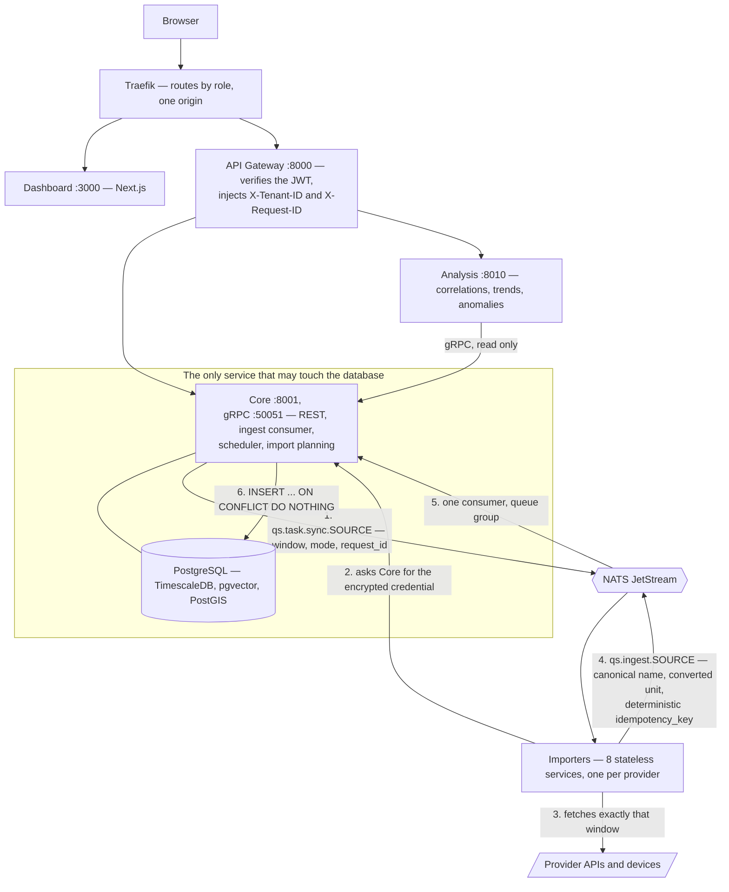

# Architecture and data flow

## Overview

The platform is a set of independently deployable services with a strict division of
responsibility. The most important rule: **only `services/core/` owns the database.** No other
service imports a database driver.



## Services

| Service | Responsibility | Database access |
| --- | --- | --- |
| `services/api-gateway/` | Entry point, JWT verification, header injection, reverse proxy | no |
| `services/core/` | REST API, gRPC read interface, ingest consumer, import planning, scheduler | **yes, exclusively** |
| `services/importers/*` | Fetching or receiving external data | no |
| `services/analysis/` | Correlations, trends, anomalies, routines | no, reads from Core over gRPC |
| `apps/dashboard/` | Next.js interface | no |

## The data flow of an import

1. The user triggers an import, or a connector is configured.
2. **Core computes the window** from the poll interval and the import history (see
   [Smart and force import](features/smart-import.md)) and creates a `SyncRun`.
3. Core publishes `qs.task.sync.<source>` with `tenant_id`, `request_id`, `sync_run_id`, `mode`,
   `window_start` and `window_end`.
4. The importer fetches its credentials over
   `GET /api/v1/internal/data/sources/<source>/token` — it stores none itself.
5. The importer calls the provider API for exactly that window.
6. For every data point a deterministic `idempotency_key` is derived and an event is published on
   `qs.ingest.<source>`.
7. Core's consumer writes with `INSERT … ON CONFLICT DO NOTHING` and counts accepted and duplicate
   points onto the `SyncRun`.
8. The importer reports the outcome; only a successful run moves the resume point.

For push sources (Apple Health, Streak) steps 1–5 do not apply: the external service sends
straight to the importer, which resolves the tenant from the API key.

## Idempotency

```text
idempotency_key = SHA256(tenant_id + ":" + source_id + ":" + metric_type + ":" + timestamp)
```

The uniqueness constraint in the database is `UNIQUE (tenant_id, idempotency_key, timestamp)`. The
timestamp is part of it because TimescaleDB requires the partitioning column in every unique index.

!!! warning "What follows from that constraint"
    The same `idempotency_key` with a *different* timestamp creates a second row. Transformers must
    therefore normalize timestamps and must never fall back to `now()` — that exact mistake used to
    produce fresh duplicates on every sync.

## Tenant isolation

- Every query filters by `tenant_id`.
- The tenant is derived from the verified bearer token and from nothing else.
- An `X-Tenant-ID` header may agree with the claim but never override it; a contradiction is a `403`.
- Internal endpoints (`/api/v1/internal/*`) are not reachable from outside through the Gateway.

Details: [Authentication and sessions](features/authentication.md).

## Correlation

Every request carries an `X-Request-ID`. It is propagated across the Gateway, Core, the NATS event
and the importer, and appears in every log as `[req_id=…]`.

## Data model (excerpt)

| Table | Purpose |
| --- | --- |
| `tenants`, `users` | Workspace and identities kept separate. `users.sessions_valid_from` is the cut-off from which older access tokens are rejected |
| `data_sources` | One row per configured connector *instance*. A tenant may hold several of a type — three calendars, two weather locations — told apart by `display_name` and unique on `(tenant_id, source_type, display_name)` |
| `data_points` | The time series, a TimescaleDB hypertable |
| `sync_runs` | Import and audit log, the basis for adaptive windows |
| `api_keys` | Tenant-bound inbound keys, stored only as a hash |
| `refresh_tokens`, `revoked_access_tokens` | Sessions and revocation |
| `tenant_shares` | Grants between workspaces |
| `explorer_views` | Saved queries |

Migrations run through Alembic in `services/core/alembic/` and nowhere else, and must contain a
working `downgrade()`. CI checks that by running a rollback and a second upgrade after the first
upgrade.

## Analyses: their own service, reading only over gRPC

The analyses used to run inside Core and read SQL directly in the request handler.
`services/analysis/` was a placeholder and Core's gRPC server was a stub — so there was no
transport a separate service could have read over at all.

Today:

- Core runs `CoreDataService` on port `50051` with `QueryDataPoints`, `GetDataPoint`,
  `ListMetricTypes` and `ListDataSources`.
- Every call needs an internal service credential; every query filters by `tenant_id`, which is
  validated as a UUID first.
- `DataSourceSummary` carries only `id`, `source_type` and `display_name`. There is deliberately no
  field in which a connector credential could cross the service boundary, and a test pins the field
  set exactly so adding one is a decision somebody has to make on purpose.
- The Analysis service holds **no** database connection. A test reads the AST of every module and
  fails as soon as a database driver is imported there.

That last check used to exist for Analysis alone, which made rule 1 a property of one service out of
ten. `tools/tests/test_service_boundaries.py` now walks every service except Core and fails on an
imported driver, on a *declared* dependency on one, and on a migration directory outside Core — so a
new importer is covered the day it is added, rather than the day somebody writes it a test.

The interface calls `/api/v1/analysis/insights`; the Gateway proxies it through.

## Scheduled imports

`poll_interval_hours` used to control only the window size — nothing was ever triggered. Core now
runs a scheduler, because Core is the only service that knows both of the things the decision needs:
the connector configuration and the import history.

- Every five minutes it checks which connectors are due.
- A tick takes a transaction-scoped Postgres advisory lock, so that with several Core instances only
  one of them plans.
- A connector with an import already running is skipped — keyed on the connector *instance*, so one
  of a tenant's two calendars importing does not hold up the other. After six hours a run counts as
  orphaned, since otherwise a crashed importer would block its connector forever.
- Push connectors are never scheduled. Nothing subscribes to `qs.task.sync.apple_health`, so a
  planned run there could only ever expire as stale while the connector showed as queued throughout.
- Turn it off with `SCHEDULER_ENABLED=false`.

That also means the importers' former process-local `active_syncs` lock no longer carries any weight:
Core never queues the duplicate job in the first place.

## Ending sessions: two mechanisms, because one is not enough

`revoked_access_tokens` is indexed on `jti` and ends **this one** session — which is all it can do,
because an access token is otherwise indistinguishable from any other.

`users.sessions_valid_from` ends **all of them**. The denylist cannot, because a `jti` only becomes
known when the token is presented; "every outstanding token of this account" is not an enumerable
set. The cut-off is checked against each token's `iat` and so covers all of them at once.

Both fail closed: if the database is unreachable the request is rejected rather than let through —
otherwise an outage would make every signed-out token valid again.

The cut-off is triggered by a password change, `logout all_sessions`, a detected refresh-token replay
and [back-channel logout](features/oidc.md#back-channel-logout).

## The Gateway passes the interface through without buffering it

The UI proxy used to read the complete response before forwarding the first byte. That defeats
streaming SSR and holds every response in memory in full, once. It streams now.

The `httpx.AsyncClient` deliberately outlives the handler that created it: the body is still being
read through it while Starlette is already sending. Closing it on the way out of the function — which
`async with` would do — would truncate every response to whatever had arrived by then.

!!! note "What that did not fix"
    The rework was meant to make `next dev` work behind the Gateway. It does not. Measured
    afterwards: the proxied document is byte-for-byte identical to the one fetched directly, so is
    every chunk, and the HMR socket connects — and the page still does not hydrate, with no error
    anywhere. So buffering was not the cause. The browser tests continue to run against a production
    build, which is what gets deployed anyway.

## Known limitations

- Analyses may be skipped when the data is very thin. That is deliberate: a weakly supported
  relationship is more misleading than none.
- `next dev` does not work behind the Gateway (see above). Straight on port 3000 it does: the dev
  server rewrites `/api/*` to the Gateway, so the API calls still arrive. That rewrite is
  development-only — in production the browser talks to one origin and Traefik does the routing.
