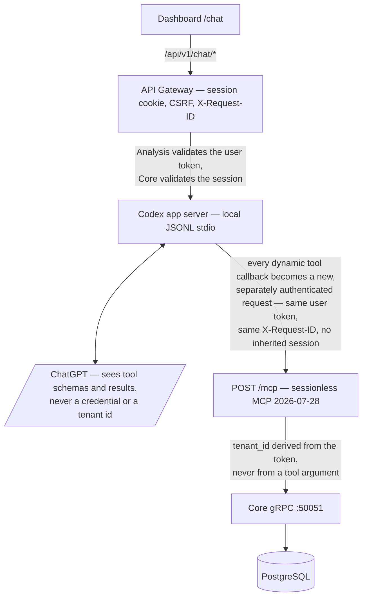

# AI chat over personal metrics

The dashboard has a separate `/chat` page for questions about personal metrics,
trends, unusual values, data quality, and relationships. It uses the official Codex
app server with a ChatGPT subscription login. It does not require or accept an OpenAI
API key.

The feature exists to make the read-only analytics surface conversational without
giving a model direct database, filesystem, network, or tenant-selection access.

Assistant responses are rendered as GitHub-Flavored Markdown, including headings,
lists, links, quotations, code blocks, strikethrough, and tables. User messages stay
plain text. The renderer uses an explicit element allowlist: raw HTML and images are
discarded, and rendered links open in a separate tab without opener access. This
keeps model output readable without allowing it to inject markup or load external
tracking resources.

## Data flow and service boundaries

The loop back into `POST /mcp` is the point of the design, not an implementation detail:
the model's tool call does not get a shortcut into the data layer, it goes through the
same front door as any other MCP client and is authenticated again on the way in.

Only Core owns the database. Analysis contains no SQL or database driver, and the
Gateway does not read platform data. The model sees the read-only tool schemas and
their results, never the platform JWT, ChatGPT credential, tenant identifier, or Core
credential. Every dynamic tool invocation is translated into a new sessionless MCP
request; no identity or MCP session is inherited from a previous call.

Chat threads and MCP sessions are different things. A signed, expiring thread token
binds a Codex conversation to one platform `tenant_id` and `user_id`. The MCP data
protocol remains stateless and re-authenticates independently on every tool call.

## Connect a ChatGPT subscription

1. Sign in to the platform as a role listed in `CHAT_ALLOWED_ROLES` (`owner` by
   default).
2. Open **AI chat** in the sidebar.
3. Select **Connect ChatGPT**.
4. Open the device-login URL and enter the displayed one-time code.
5. Return to the chat page. It detects the completed login and enables the composer.

Codex owns this [device authentication flow](https://developers.openai.com/codex/auth).
The platform never asks for a ChatGPT password and never parses or logs the resulting
credential. A local checkout requires `codex` on `PATH` and uses Codex's configured
credential store. The official [Codex configuration reference](https://developers.openai.com/codex/config-reference)
documents `file`, `keyring`, and `auto` as credential-store options.

The Analysis image uses `file` because a container normally has no usable OS keyring. Its
live `CODEX_HOME` remains a RAM-backed tmpfs, while the platform stores only an opaque,
Fernet-encrypted copy of `auth.json` in the private `analysis-auth` named volume. The
encrypted copy is restored before the app server starts and replaced atomically after an
authenticated ChatGPT account check. The encryption key comes from `ENCRYPTION_KEY` (the
published development fallback is used only for local development). Plaintext credentials
are never written to the persistent volume, platform database, broker, or logs.

## Configuration

| Setting | Default | Purpose |
| --- | --- | --- |
| `CHAT_ENABLED` | `true` | Enables the Analysis chat adapter |
| `CHAT_CODEX_COMMAND` | `codex` | Codex executable on the Analysis host |
| `CHAT_MODEL` | empty | Optional model override; empty uses the subscription default |
| `CHAT_ALLOWED_ROLES` | `owner` | Comma-separated platform roles allowed to use the operator subscription |
| `CHAT_THREAD_TTL_MINUTES` | `720` | Lifetime of a signed thread token |
| `CHAT_TURN_TIMEOUT_SECONDS` | `300` | Maximum duration of one model turn |
| `CHAT_MAX_MESSAGE_CHARS` | `8000` | Maximum user-message size |
| `CHAT_CREDENTIALS_STORE` | `keyring` | Codex credential store (`keyring`, `file`, or `auto`) |
| `ENCRYPTION_KEY` | development fallback | Fernet key material used to encrypt the opaque Codex auth cache |
| `CHAT_AUTH_BLOB_PATH` | temporary service path | Path for the encrypted auth blob; Compose uses the private `analysis-auth` volume |

The Codex process is launched with web search disabled, network disabled, approvals
disabled, an empty inherited shell environment, an isolated configuration home, and a
permission profile that exposes only minimal runtime files. Its developer instructions
restrict it to the four dynamic analytics tools.

## Retrieving and analysing data

The chat can use the same four tools documented under
[Stateless MCP analytics](mcp.md): `list_metrics`, `query_metric_series`,
`analyze_metrics`, and `get_data_quality`. Those tools retrieve tenant-scoped values
through Core's gRPC API and return canonical metric names, registry units, time
windows, sources, point counts, truncation state, and correlation IDs.

Scripts and future external agents do not need the chat adapter. They can call the
same internal MCP endpoint directly after appropriate external authentication and
ingress controls are added. Dashboard charts and exports continue to use the normal
tenant-scoped Gateway/Core APIs; chat introduces no alternate store or hidden data.

## Interpretation guidance

- Ask for a stated time window and metric when precision matters.
- Treat correlations and lagged relationships as hypotheses, not causes.
- Check the data-quality result before interpreting sparse series.
- Compare results with the source application when a value appears surprising;
  imported points retain provider value and unit provenance.
- Do not use a model response as diagnosis or treatment advice.

## Known limitations

- ChatGPT plan limits and model availability still apply. A subscription is not an
  unlimited or dedicated API allocation.
- Conversation history is ephemeral and is not stored in the platform database.
  **New chat** deliberately discards the current browser-side view.
- A Codex thread belongs to the Analysis process that created it. A multi-replica
  deployment needs sticky routing for `/api/v1/chat/turn` or a dedicated external
  app-server tier. The stateless MCP endpoint itself needs neither.
- The encrypted auth cache is private to the Analysis deployment. Rotating `ENCRYPTION_KEY`
  intentionally invalidates the old cache and requires device login again.
- The chat is read-only. It cannot configure connectors, import data, edit points, or
  change account settings.
