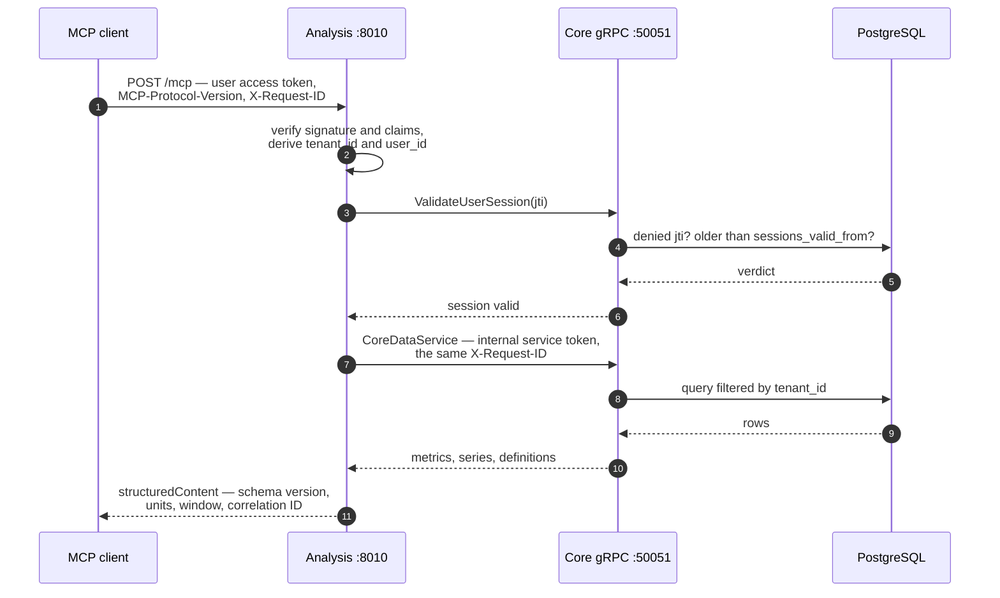

# Stateless MCP analytics

The Analysis service exposes personal metrics and deterministic statistics through
Model Context Protocol (MCP) revision `2026-07-28`. It is the data boundary for the
dashboard AI chat and for other MCP clients: callers can read and analyse measurements,
but they cannot create, update, or delete platform data.

## Why the endpoint is stateless

`POST /mcp` accepts the sessionless `2026-07-28` protocol only. Every request carries
its protocol metadata and is authenticated independently. The service does not accept
`initialize`, `notifications/initialized`, `Mcp-Session-Id`, standalone GET streams,
or older MCP revisions. Any Analysis replica can therefore serve the next request
without sticky routing.

This is different from the older SDK option called `stateless_http`. That option
changes how initialization-era HTTP sessions are stored; it is not the sessionless
protocol used here.

## Data flow and tenant isolation



The identity travels down that chain and never back up it. The tool schemas contain no
`tenant_id` or `user_id`, so an unknown identity-shaped argument cannot override the
authenticated principal, and step 3 means a revoked token stops working on the next
request rather than at its expiry. A Core outage fails the whole exchange closed with
`503`, because a service that cannot check revocation cannot serve data either.

Analysis imports no database driver and performs no SQL; Core remains the only database
owner. Note which arrows touch `PostgreSQL` in the diagram above: all of them start at
Core.

The MCP response contains `structuredContent` with a schema version, canonical metric
names, registry units, the analysed time window, configured source types, point count,
truncation flag, computation time, and correlation ID. Dynamic metric namespaces use
the unit recorded in point metadata when all returned points agree on one unit.

## Tools

| Tool | Purpose | Important bounds |
| --- | --- | --- |
| `list_metrics` | Metrics observed for the authenticated tenant, with registry definitions and observed range | 365-day maximum window, 200 results; counted by Core, never read |
| `query_metric_series` | Chart-ready raw, hourly, daily, or weekly values for one canonical metric, optionally filtered by value and ranked | 2,000 output points |
| `analyze_metrics` | Deterministic summaries, trends, and correlations | 10 metrics, 365 days |
| `get_data_quality` | Coverage, expected-day gaps, plausible-range outliers, source distribution, and analysis sufficiency | 20 metrics, 365 days |

All tools advertise `readOnlyHint=true`, `destructiveHint=false`,
`idempotentHint=true`, and `openWorldHint=false`. Aggregated values follow the central
metric registry: accumulating metrics are summed, momentary measurements averaged,
standing values take the latest point, and peaks retain the maximum.
The `query_metric_series` and `analyze_metrics` tools accept an optional `source_id`. If a metric has points from more
than one connector instance and no source is selected, the tool returns the stable
`AMBIGUOUS_METRIC_SOURCE` error instead of combining potentially overlapping values. Core's gRPC
series response likewise keeps each `(metric_type, source_id)` series separate and reports the
candidate source IDs.
For daily summaries, repeated values inside one day collapse to the newest value
before longer periods are aggregated, preventing overlapping imports from counting a
day twice. Namespaced dynamic metrics have runtime-defined units and aggregation, so
they support raw queries and quality counts but not aggregated series or statistical
analysis until Core exposes their tenant-specific definition.

`list_metrics` asks Core for a grouped summary — one row per metric with its point
count and first and last timestamp — rather than reading the points and counting them
here. That is a correctness property, not only a performance one: the previous version
transferred every point in the window to learn the names, and a tenant recording
location traces exceeded the client's 100,000-point transfer bound within the default
90 days. A bounded read that comes back truncated is treated as a failed read, so the
catalogue stopped answering at all — and since it is the first call a model makes, the
chat lost access to every metric at once.

### Filtering and ranking by value

`query_metric_series` accepts `min_value` and `max_value` — inclusive bounds applied
in Core's query rather than after the transfer, so a narrow band costs a narrow read —
and `order`, which turns the series into a ranking:

| `order` | Meaning |
| --- | --- |
| `time` (default) | Chronological. A chart. |
| `value_desc` | Largest first. |
| `value_asc` | Smallest first. |

With `bucket="raw"`, a ranking is answered by Core: it orders the whole window and
returns only the rows asked for, so "my three longest workouts" costs three rows rather
than the window they were found in. With any other bucket the ranking is applied *after*
aggregation, because the values being ranked do not exist until they have been
aggregated — `bucket="day", order="value_desc"` ranks daily totals, which is a different
question from ranking single points and usually the more interesting one.

`activity_type` keeps only the points recorded during one kind of activity, using a
canonical key — `running`, `cycling`, `strength_training` — rather than the provider's
own wording. That distinction is the whole point: the wording is display prose in the
user's language and differs per provider and per import path, so one workspace held
`Radfahren`, `Outdoor Radfahren` and `Innenräume Radfahren` for a single activity and
two spellings for running. A filter on prose would have matched none of it reliably.
Importers resolve the type on the way in and keep the original wording as
`activity_label`; [`python -m core.activity_backfill`](../operations.md#resolving-stored-workouts-into-activity-types)
does the same for points stored before that existed. An unknown key is refused with
`UNKNOWN_ACTIVITY_TYPE` and the list of known ones, because an empty series and a
misspelled filter are indistinguishable to a caller and mean opposite things.

Together these answer the question this all started from — "what was my longest run" is
`workout_distance`, `activity_type="running"`, `order="value_desc"`, and the largest
overall workout being a bike ride no longer gets in the way.

Two consequences worth stating outright:

- **A ranking is cut, never sampled.** A long chronological series is sampled down to
  `max_points` while keeping its shape; doing that to a ranking would discard precisely
  the entries that were asked for.
- **Points with no value are excluded** whenever a bound is set or the order is by value.
  A null is not comparable, and reading it as zero would rank a point that was never
  measured against ones that were.

A value-ordered query answers exactly one page and offers no cursor: the pagination
cursor is a `(timestamp, id)` keyset, and a value has neither the uniqueness nor the
monotonicity a cursor needs. `order` is echoed in the result so a reader can tell a
ranking from a time series — read one as the other and you invent a trend nobody
measured.

A stored metric name the registry cannot describe is reported in
`undescribed_metric_types` instead of being dropped or taking the catalogue down with
it, so a caller can say what it was unable to read about.

A refused tool call returns this server's own machine-readable `code` —
`UNKNOWN_METRIC_TYPE`, `CANONICAL_METRIC_REQUIRED`, `TIME_RANGE_TOO_LARGE`,
`SOURCE_RESULT_TOO_LARGE`, `AMBIGUOUS_METRIC_SOURCE`, `CORE_UNAVAILABLE` — because those
codes exist for a caller to act on: shorten the window, use the canonical name, pick a
source. An *unexpected* failure is reported as `INTERNAL_TOOL_ERROR` with no detail,
since its text is an implementation detail; the full reason is written to the service log
under the request's `[req_id=…]`.

Analysis results describe associations rather than causes. They provide general
information and are not medical diagnoses or treatment recommendations.

## Authentication and protocol headers

The internal v1 endpoint uses the same signed user access token as the platform API.
Analysis verifies its signature and claims, then asks Core on every MCP request whether
that `jti` has been denied or predates `users.sessions_valid_from`. Logout, password
changes, refresh-token replay, and OIDC back-channel logout therefore take effect on
the next MCP request. A Core outage fails closed with `503`.
Required request headers are:

```text
Authorization: Bearer <user-access-token>
Content-Type: application/json
Accept: application/json
MCP-Protocol-Version: 2026-07-28
Mcp-Method: server/discover | tools/list | tools/call
Mcp-Name: <tool-name>        # tools/call only
X-Request-ID: <correlation-id>
```

If `X-Request-ID` is absent, Analysis creates one and returns it in the response. It is
also propagated to Core. Browser-style requests are constrained by
`MCP_ALLOWED_ORIGINS`; every request is constrained by `MCP_ALLOWED_HOSTS` to prevent
DNS rebinding.

## Deployment and future external access

Production Compose does not publish Analysis or route `/mcp` through the public
Gateway. The development stack exposes port `8010` on loopback-oriented developer
hosts for direct testing. Treat it as an internal service endpoint.

External publication requires all of these changes together:

1. Route `POST /mcp` through the TLS ingress and add its public host to
   `MCP_ALLOWED_HOSTS`.
2. Replace the current JWT principal resolver with MCP-compatible OAuth 2.1 or a
   dedicated revocable personal token resolver. Tool handlers remain unchanged.
3. Add per-principal rate limits, token audit metadata, revocation, and external-client
   integration tests.
4. Keep `2026-07-28` mandatory; do not enable the initialization-era compatibility
   path supplied by the SDK.

The Codex app-server adapter registers these same schemas as dynamic tools for the
dashboard [AI chat](ai-chat.md). Each callback invokes this endpoint with the verified
platform credential and request ID. Once Codex supports `2026-07-28` directly, that
adapter can be removed without changing the MCP contract or tool handlers.

## Known limitations

- The endpoint is read-only and has no resources, prompts, subscriptions, or
  server-to-client requests.
- Queries are bounded to one year. A source result above the safety limit fails with
  `SOURCE_RESULT_TOO_LARGE` rather than returning partial statistics. A complete raw
  series may still be deterministically sampled for chart output; that response is
  marked `truncated`.
- Configured source types provide response-level provenance; individual source IDs are
  not exposed.
- Chat history and ChatGPT device-code login are adapter concerns and are not part of
  this endpoint. The MCP request remains sessionless even while a Codex conversation
  continues across several turns.
